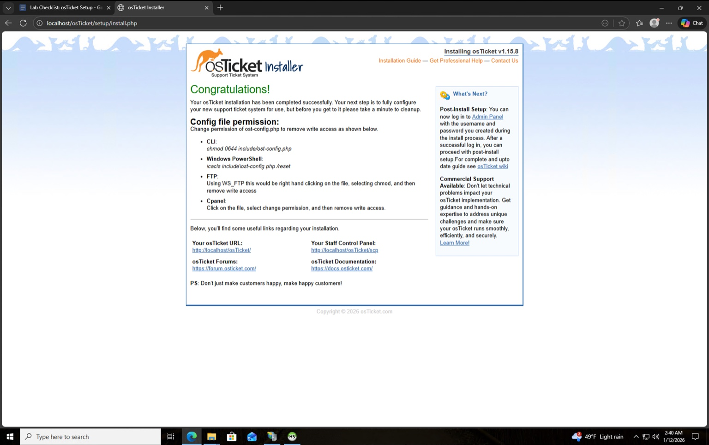
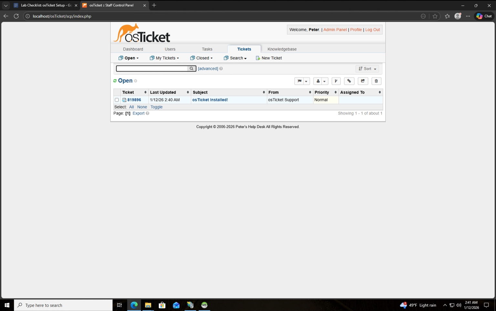
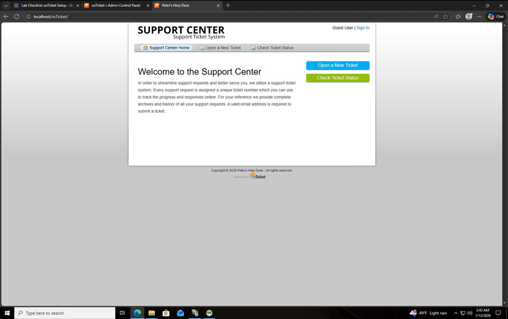
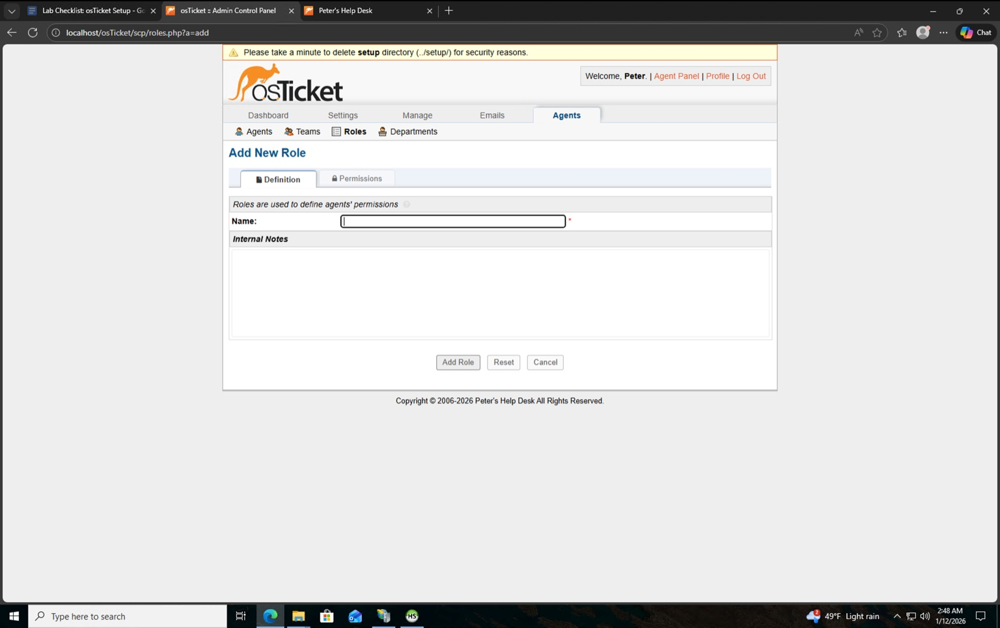
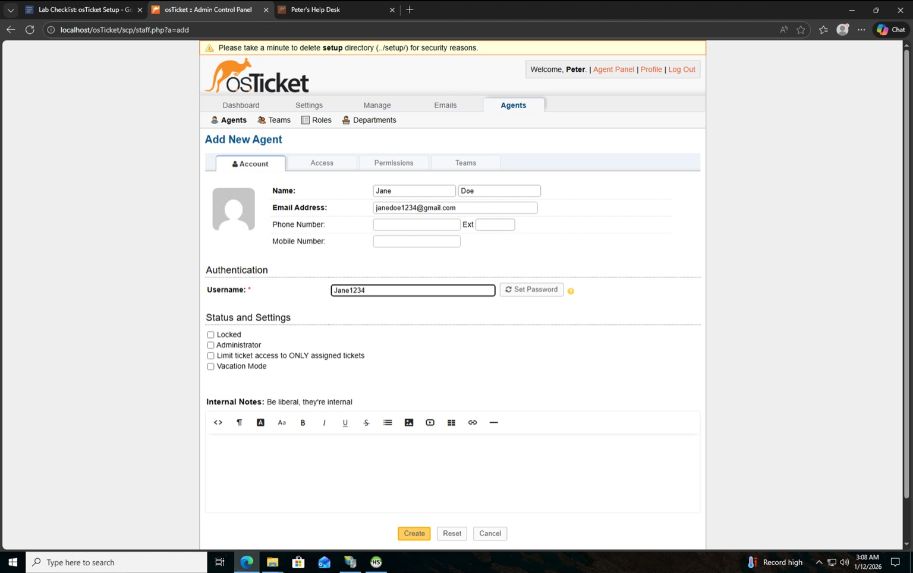
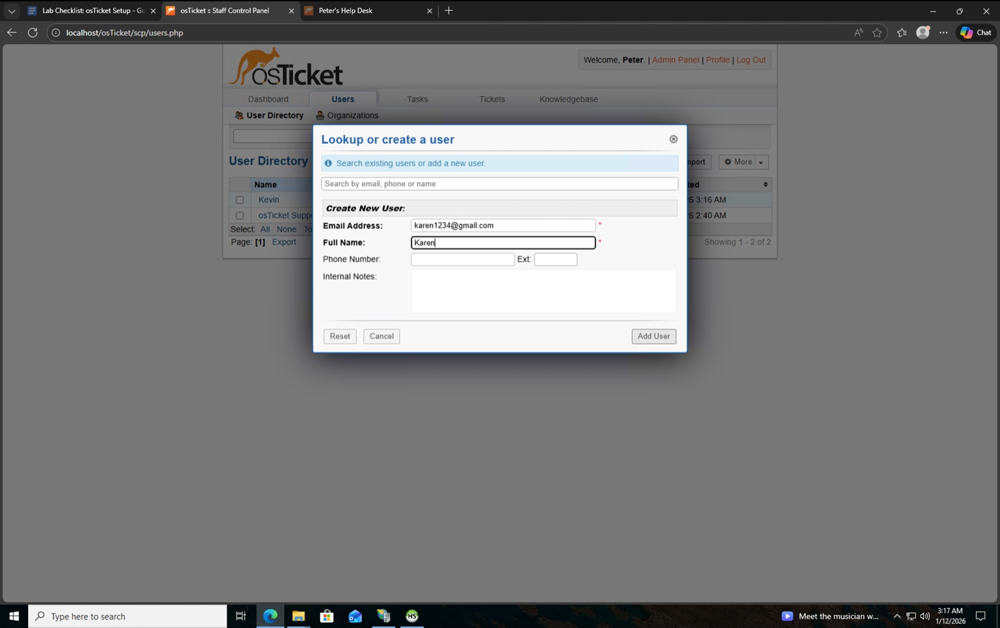
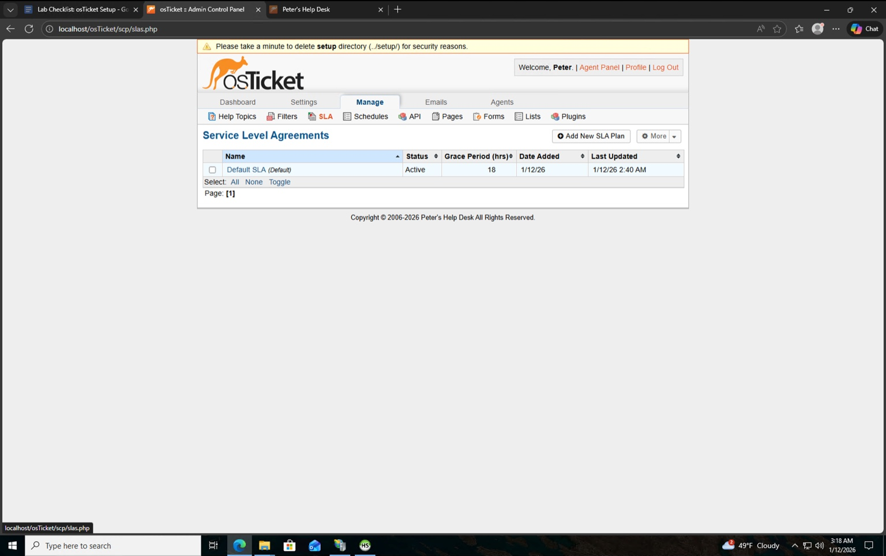
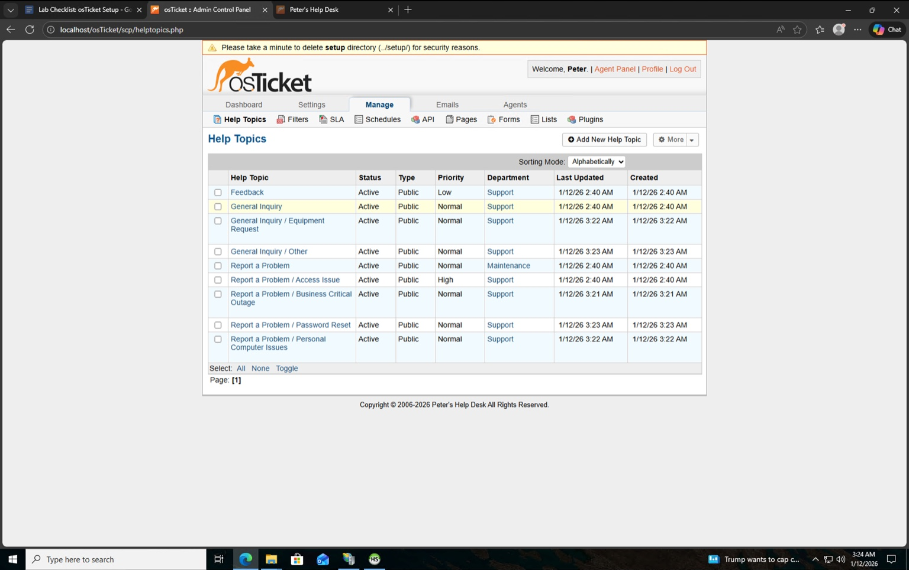
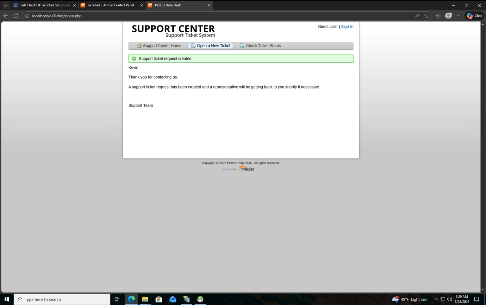

# Azure osTicket Help Desk Lab – Screenshots & Walkthrough

This section documents the step-by-step configuration of an **osTicket Help Desk system deployed in Microsoft Azure**, demonstrating experience as both a **system administrator** and an **end user**.

---

## 1. osTicket Installation Successful

In this step, I successfully installed osTicket on a Windows Server Virtual Machine hosted in Azure.  
This confirms that all prerequisites (IIS, PHP, MySQL, required extensions, and file permissions) were configured correctly and the application is ready for post-installation setup.

---

## 2. Admin Dashboard

This screenshot shows the osTicket **Admin/Staff Dashboard**, where administrators and agents manage tickets, users, SLAs, departments, and system settings.  
From here, I verified system access and confirmed the help desk was operational.

---

## 3. User Support Portal

This is the **end-user support portal**, where users can submit new tickets and check ticket status.  
This view demonstrates the user-facing experience of the ticketing system.

---

## 4. Agent Roles Configuration

I created and configured **agent roles**, defining permission levels for help desk staff.  
Roles control what agents can view, modify, and manage within the system, ensuring proper access control and security.

---

## 5. Departments Configuration

In this step, I configured **departments** (e.g., Support, SysAdmins) to logically organize ticket routing.  
Departments help ensure tickets are assigned to the correct teams based on issue type.

---

## 6. Add Support Agent

Here, I added a **support agent account**, assigning it a role and department.  
This demonstrates user management and staff onboarding within the ticketing system.

---

## 7. Create End User

I created an **end-user account** to simulate a real customer submitting support requests.  
This allowed me to test ticket creation and lifecycle management from a user perspective.

---

## 8. SLA Configuration

This screenshot shows **Service Level Agreement (SLA)** configuration.  
SLAs define response and resolution time expectations for tickets, helping enforce service standards and priorities.

---

## 9. Help Topics Setup

I configured **Help Topics**, which guide users when submitting tickets and automatically apply routing rules, priorities, and departments.  
This improves ticket categorization and operational efficiency.

---

## 10. Ticket Submitted (User View)

This final screenshot shows a **ticket successfully submitted by an end user**.  
It confirms that the full ticket lifecycle works correctly—from user submission to agent visibility and resolution.

---

## Lab Summary

This project demonstrates hands-on experience with:
- Microsoft Azure Virtual Machines
- Web server and application deployment
- Help desk ticketing systems
- Role-based access control
- SLA and workflow configuration
- End-user and administrator perspectives
